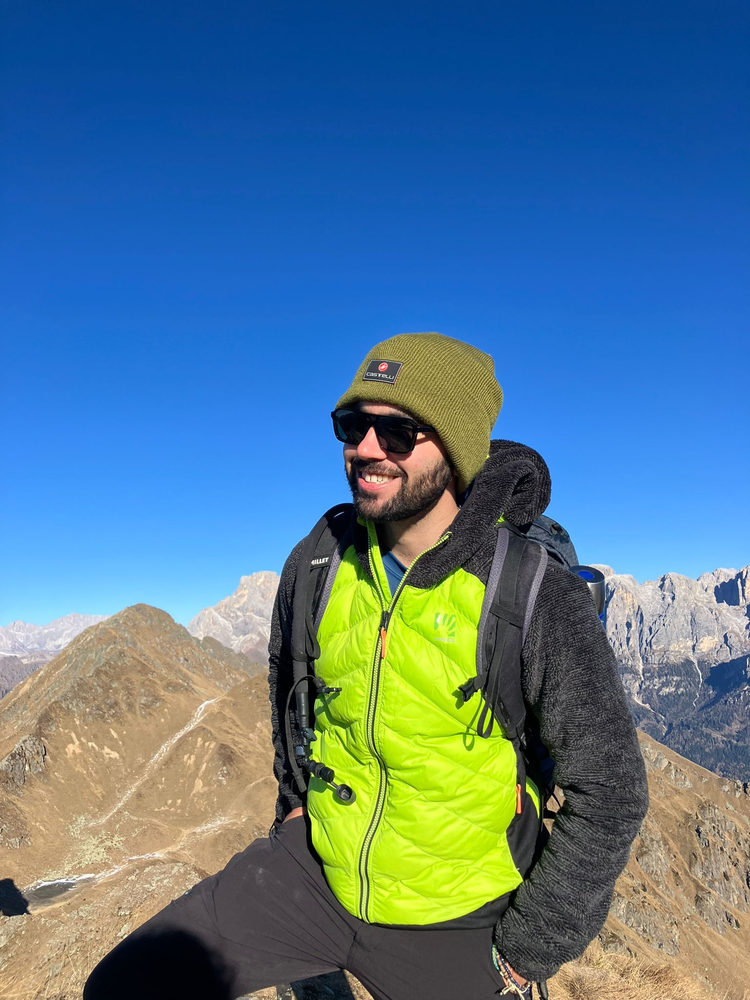

    
    
Me in my homeplace, the Dolomites.

## About Me

Hi! 

I hold a **PhD** in Computer Science from the University of Padova, with an MSc in Theoretical Physics.

My PhD thesis work was supervised by [Prof. Francesco Silvestri](https://www.dei.unipd.it/~silvestri/index.html) and co-supervised by [Prof. Martin Aumüller](https://itu.dk/~maau/). My research spans both theoretical and applied domains, with a core focus on **Differential Privacy** and **Data Structures** for high dimensional data.

Currently living in Oslo working as a **AIoT researcher** for Havguard AS, developing and deploying innovative IoT solutions and autonomous systems from seabed to space. 

## CV
📄 [**Download My CV**](documents/CV.pdf)

### Research Interests
* **Differential Privacy** 

Is a mathematical definition that allows to quantify how much a randomized algorithm is private. For any two neighboring dataset $$D\sim D'$$ where they differ on one user, a randomized algorithm $$\mathcal{M}$$ is said to be $$\varepsilon$$-differentsially private if

$$
\text{Pr}[\mathcal{M}(D)=y]\leq e^\varepsilon \text{Pr}[\mathcal{M}(D')=y].
$$

It is a measure of divergence between two probability distributions (it is a max divergence). 

The intuition is that by upper bounding the divergence between the realizion on $$D$$ and $$D'$$, any advesary cannot reliably distinguish between the two, making effectivetly the contribution of a single user private. This is usually achieve by masking the real statistics with additive noise, obtaining thus a privacy-utility trade-off.

* **Randomized Algorithms** & **Data Structures** 

Do you know that if you have an algorithm that succeeds with probability strictly larger than $1/2$, it is sufficient to run that algorithm independently $$O(\log n)$$ times and pick the most common answer to have a probability of success that is $$1-O(1/n)$$?

This is a standard result of concentration of measure in probability theory, and it is the foundational trick in many randomized algorithms like the Count Min-Sketch, which is essential in big data application as it allows to compute the frequency of a stream of data while keeping the space constant.

* **Probability and Statistics**

Do you know that if you draw $$N$$ independent samples from a standard normal distribution, their maximum value is incredibly predictable? As $$N$$ grows, the maximum of these $$N$$ random variables sharply concentrates around $$\sqrt{2\log N}$$. Surprisingly, the fluctuations around this value shrink to zero at a rate of $$O(1/\sqrt{\log N})$$. This phenomenon is called **super concentration** as the variance vanishes as the number of random variable grows. 

This is a standard result of **extreme value theory**, a tool I extensively used in a joint work with my supervisors [Differentially Private High-Dimensional Approximate Range Counting, Revisited](https://drops.dagstuhl.de/entities/document/10.4230/LIPIcs.FORC.2025.15). 

* **Deep Learning**

Do you know that training a machine learning model on private data can be problematic due to the phenomenon of **memorization**? Generative AI algorithms may regurgitate private data if no precautions are taken. One way to mitigate this effect is to perform a **differentially private training** by adding noise to the stocastic gradient descent

$$\theta_{t+1} = \theta_t - \eta {1\over L}\bigg(\sum_{i\in B}\text{clip}_C(\nabla_\theta \mathcal{L}(\theta_t, x_t)) + \mathcal{N}(0, \sigma^2C^2 \, 1)\bigg).$$

A summary of the state of the art (up to 2024) can be found in my project [The Privacy Analysis of the Differential Private Stochastic Gradient Descent](documents/The_Privacy_Analysis_of_the_Differential_Private_Stochastic_Gradient_Descent.pdf).

There are well know libraries that provide good wrapper to TensorFlow and Pytorch for differentially private training. In of the is Opacus.

### Previous Research Interests
* **Complex Systems** (MSc thesis in Economic Complexity)
* **Mobility Data Science** (PhD collaboration with [Motion Analytica](https://www.motionanalytica.com))
* **Quantum Computing**
* **Statistical Physics**

### Academic & Professional Experience

* **AIoT Researcher - Havguard AS - Oslo.** Engineered and adapted predictive algorithms in C++ for resource-constrained environments, focusing
on high-performance and system stability.
* **Research Background.** Prior to my PhD, I completed my studies in **Theoretical Physics** at the University of Padova, which provides the mathematical foundation for my current work in randomized algorithms.
* **Visiting Research.** In 2024, I was a visiting PhD student at the **IT University of Copenhagen**, working with [Prof. Rasmus Pagh](https://rasmuspagh.net) as part of the [Providentia project](https://www.rasmuspagh.net/providentia/) and my co-supervisor [Prof. Martin Aumüller](https://itu.dk/~maau/).
* **Industry Collaboration.** I collaborate with [Motion Analytica srl](https://www.motionanalytica.com/en/homepage-en/) on mobility research. Our collaborative work was recently published in a peer-reviewed journal [link](https://www.mdpi.com/2412-3811/11/1/4).

## Beyond the Lab

In my spare time, I prioritize staying active and creative:

* **Hiking:** I am a hiking guide assistant for [The South Adventure](https://www.thesouthadventures.com). I recently completed the Annapurna Circuit trek in Nepal reaching 5400 meters above sea level. Hiked the highest mountain in North Africa, the Jbel Toubkal. 
* **Music:** I play bass, guitar, and a bit of piano. I was previously part of a band and contributed to the album **[L'assenzio](https://open.spotify.com)** (Spotify).
* **Composition:** I enjoy writing and producing music; you can listen to some of my tracks on [SoundCloud](https://soundcloud.com/user-373535867).
* **Fitness:** I love calisthenics.